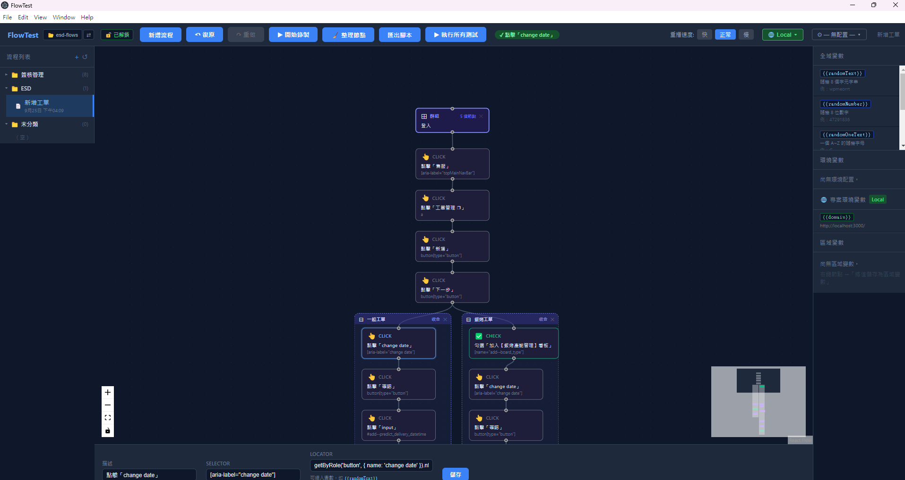

# FlowTest

**FlowTest 是一個用來快速產生及管理 Playwright 腳本的桌面工具。**



## 核心功能

### 1. 可分支的視覺化流程圖

錄下的操作不是一支線性腳本，而是畫布上的一棵節點樹，每條路徑就是一個測試案例。你可以從任一節點分支錄製：FlowTest 會先自動把瀏覽器重播到該節點，再從那裡繼續錄，共用的前段步驟只需錄一次。

### 2. 多層環境管理：錄一次，在不同環境重複使用

網域與變數值依專案環境（DEV / UAT / PRD）和環境配置（如不同角色、帳號）分層管理。切換環境或配置不需要重新錄製，同一份流程就能在各個環境重複使用。

### 3. 產出標準 Playwright 腳本

匯出的是標準的 `.spec.ts`，不依賴 FlowTest，可以直接用 `npx playwright test` 執行、納入版控、接上 CI。

此外還提供子流程重用、私密資料加密、手寫程式碼節點，以及不需要另外安裝 Node 的內建測試執行器。

> **專案狀態：MVP 開發中。** 資料格式仍可能變動，目前不提供舊資料的遷移。

---

## 目錄

- [核心功能](#核心功能)
- [快速開始](#快速開始)
- [基本使用流程](#基本使用流程)
- [核心概念](#核心概念)
  - [工作區（Workspace）](#工作區workspace)
  - [流程、節點與分支](#流程節點與分支)
  - [子流程](#子流程)
  - [變數系統](#變數系統)
  - [專案、環境與環境配置](#專案環境與環境配置)
  - [私密資料（保險庫）](#私密資料保險庫)
  - [程式碼節點](#程式碼節點)
- [錄製能力](#錄製能力)
- [重播與測試執行](#重播與測試執行)
- [匯出的腳本長什麼樣子](#匯出的腳本長什麼樣子)
- [編輯器操作](#編輯器操作)
- [開發指南](#開發指南)
- [架構概覽](#架構概覽)
- [專案結構](#專案結構)
- [已知限制](#已知限制)

---

## 快速開始

### 環境需求

- Node.js 20+（**僅開發時需要**；打包後的 App 使用 Electron 內建的 Node）
- Windows / macOS / Linux

### 安裝與啟動

```bash
npm install
npm run dev
```

首次啟動會看到 **Welcome 畫面**，請先選擇一個資料夾作為工作區（見[工作區](#工作區workspace)）。若畫面上方提示「尚未安裝 Chromium 瀏覽器」，點「安裝瀏覽器」即可（等同 `playwright install chromium`）。

> **注意：** 若你的 shell 設定了 `ELECTRON_RUN_AS_NODE` 環境變數，Electron 會以純 Node 模式啟動並當掉。執行 `npm run dev` 前請先清除它。

### 常用指令

| 指令 | 用途 |
|------|------|
| `npm run dev` | 啟動開發模式（electron-vite，含熱重載） |
| `npm run build` | 建置 main / preload / renderer 三個 bundle 到 `out/` |
| `npm run preview` | 預覽正式建置結果 |
| `npm run typecheck` | 型別檢查（`tsc -b`，涵蓋全部 bundle；目前最接近測試的驗證關卡） |
| `npm run dist` | 建置並產生安裝檔到 `release/`（Windows: NSIS、macOS: app、Linux: AppImage） |

---

## 基本使用流程

1. **開啟工作區** — 在 Welcome 畫面選擇（或拖曳）一個資料夾，建議放在你要測試的專案 repo 裡，例如 `my-app/e2e/`。
2. **建立專案** — 在左側流程清單新增專案，填入專案名稱、環境名稱（預設 `DEV`）與網域（如 `http://localhost:3000/`）。
3. **新增流程** — 選擇要歸入的專案並命名。流程的起始網址取自該專案當前環境的 `domain`。
4. **開始錄製** — 按工具列 **▶ 開始錄製**，FlowTest 會開啟 Chromium 並導向網域。你在瀏覽器中的操作會即時長成畫布上的節點。
5. **加入斷言** — 使用被錄製瀏覽器右側的工具列（👁 可見 / T 文字 / = 值），點選元素即產生斷言節點；`Esc` 取消。
6. **停止錄製** — 按 **⏹ 停止錄製**。
7. **錄製其他分支** — 在任一節點按右鍵 →「**從此節點分支錄製**」，瀏覽器會先自動重播到該節點，再從那裡繼續錄。
8. **調整節點** — 點選節點後在下方屬性面板修改描述、locator、值等欄位，按「儲存」寫入。
9. **執行測試** — 按 **▶ 執行所有測試**，FlowTest 會匯出 spec 並以內建的 Playwright 執行，輸出即時顯示在視窗中；結束後可開啟 HTML 報告。
10. **提交版控** — 流程與專案都是工作區內的 JSON 檔案，用你平常的 git 流程 commit 即可。

---

## 核心概念

### 工作區（Workspace）

**FlowTest 的所有資料都存在一個你指定的資料夾裡，這個資料夾就是工作區。** 把它放進自己的專案 repo，測試資料的版本控制就交給你自己的 git；不同 repo 之間也天然互相隔離。

```
my-app/                          ← 你的專案 repo
├─ src/ ...
├─ .gitignore                    ← FlowTest 不會改動這個檔案
└─ e2e/                          ← 你選定的工作區
   ├─ flows/{flowId}.json        流程（節點、座標、群組、配置、專案歸屬）
   ├─ projects/{id}.json         專案（環境清單、專案環境變數）
   ├─ fixtures/                  上傳測試用的檔案副本
   ├─ exports/                   產生的 .spec.ts 與 helpers（不進版控）
   │  └─ .gitignore
   ├─ .flowtest/                 執行產出物、報告、密鑰檔、備份（不進版控）
   │  └─ .gitignore
   ├─ playwright.config.ts       由 FlowTest 產生，執行時以 --config 指定
   └─ .flowtest.json             工作區標記檔（含保險庫的驗證資訊）
```

- **進版控：** `flows/`、`projects/`、`fixtures/`、`playwright.config.ts`、`.flowtest.json`。
- **不進版控：** `exports/` 與 `.flowtest/` 的內容。FlowTest 在這兩個目錄各放一個 `.gitignore`（`*` + `!.gitignore`），**不會修改你原本的 `.gitignore`**。
- **每次開啟都會補齊結構**，且永不覆寫既有檔案，所以剛 `git clone` 下來、缺少被忽略目錄的工作區也能直接使用。
- **外部變更會被偵測到：** App 視窗重新取得焦點時會重新讀取磁碟，所以 `git pull` 或切換分支的結果會自動反映到畫面上（錄製 / 重播進行中則略過）。
- 最近開啟的工作區記錄在 Electron 的 `userData/settings.json`（工作區之外），可隨時用工具列的 ⇄ 切換。

### 流程、節點與分支

- **流程（Flow）** 是一棵（可多根的）節點樹，每個**節點**代表一個瀏覽器動作。
- 每條「根 → 葉」路徑在匯出時成為一個獨立的 `test()`。
- 一個節點可以有多個子節點，分岔處就是不同的測試分支。
- 節點類型共 14 種：

| 類型 | 說明 |
|------|------|
| `goto` | 頁面導覽 |
| `click` | 點擊（左 / 中 / 右鍵、修飾鍵、雙擊） |
| `fill` | 文字輸入（含 `contentEditable`） |
| `selectOption` | 下拉選單（含多選） |
| `check` / `uncheck` | 勾選 / 取消勾選 |
| `press` | 按鍵 |
| `upload` | 檔案上傳 |
| `wait` | 等待元素出現 |
| `assertVisible` / `assertText` / `assertValue` | 斷言：可見 / 文字 / 值 |
| `callFlow` | 呼叫子流程 |
| `code` | 自訂 Playwright 程式碼 |

### 子流程

`callFlow` 節點會把另一個流程內嵌進來，適合登入、切換選單這類被許多測試共用的步驟。建立方式有兩種：

1. **引用既有流程**：節點右鍵「在此節點前 / 後插入子流程」，或在流程清單右鍵「加入當前流程中」。精靈會依序讓你選擇子流程（自動檢查循環引用）、選擇出口節點，以及設定配置對應（子流程有多組配置時）。
2. **從選取範圍抽取**：Shift 多選一段連續、單一入口與單一出口的節點 → 右鍵「將選取的 N 個節點另存為子流程」，系統會建立新流程並以一個 `callFlow` 節點取代原本的選取範圍。

被其他流程引用的流程會自動歸到流程清單中的「子流程」區塊。子流程可以無限層巢狀，每一層都可以指定要使用子流程的哪一組環境配置。

### 變數系統

任何節點的值與 locator 都可以使用 `{{變數名}}` 佔位符。解析優先序：

**區域變數 > 環境配置變數 > 專案環境變數 > 內建變數**

| 種類 | 來源 | 說明 |
|------|------|------|
| **區域變數** | 節點右鍵「將值儲存為區域變數」 | 把某個節點的值捕獲下來，供後續步驟使用 |
| **環境配置變數** | 工具列 ⚙ →「管理配置…」 | 屬於流程，可有多組配置（如「管理員」「一般使用者」） |
| **專案環境變數** | 工具列 🌐 →「🔧 管理環境變數…」 | 屬於專案，每個環境一個值 |
| **內建變數** | 系統提供 | 見下表 |

| 內建變數 | 產生內容 |
|----------|----------|
| `{{randomText}}` | 8 字元隨機字串 |
| `{{randomNumber}}` | 8 位隨機數字 |
| `{{randomOneText}}` | 單一 A–Z 字母 |
| `{{randomOneNumber}}` | 單一 0–9 數字 |
| `{{timestamp}}` | `yyyyMMddHHmmssSSS` 時間戳 |

選取節點後，右側側邊欄會列出所有可用變數，點擊即複製 `{{key}}`。

### 專案、環境與環境配置

- **專案（Project）** 是流程之上的一層，擁有多個**環境**（如 `DEV` / `UAT` / `PRD`）與一組**專案環境變數**。每個流程都屬於一個專案；未指定者歸入保留的預設專案「**未分類**」（不可刪除、不可改名）。
- **`domain` 是每個專案固定擁有的環境變數**（🔒 不可刪除、不可改名）。重播與匯出時，若 `goto` 網址的來源與流程的起始網址相同，就會換成當前環境的 `domain`。**切換環境 = 切換整個受測網站。**
- **環境配置（Profile）** 屬於單一流程，是一組具名的變數集合。同一流程的所有配置**共用同一組變數 key**，只有值不同；每個值還可以依環境分別設定。
- 工具列的 🌐 切換環境、⚙ 切換配置。
- 刪除專案時，**會一併刪除其中所有流程**（刪除前會確認）。

### 私密資料（保險庫）

工作區是進版控的，因此密碼這類值不能以明文存檔。任何變數或節點值都可以用 🔐 標記為**私密**：

- 私密值以通行碼衍生的金鑰（scrypt）加上 **AES-256-GCM** 加密，存成 `enc:v1:…` 字串。
- 採用**通行碼**而非綁定機器的金鑰，因此同事 clone 下來後，輸入同一組通行碼即可解密（類似 ansible-vault）。
- 通行碼會存進作業系統的金鑰圈，**每台機器只需輸入一次**。
- **保險庫鎖定時**，重播、分支錄製、匯出與執行都會直接擋下並跳出解鎖視窗，不會把 `enc:v1:…` 當成密碼打進表單。
- **變更通行碼是全有或全無的操作**：先在記憶體中重新加密所有檔案，再把原檔備份到 `.flowtest/vault-backup/`，最後一次替換；中途失敗會自動還原。
- **匯出的腳本不含明文：** 私密值以 `process.env.FT_SECRET_*` 讀取。在 App 內執行測試時由環境變數傳入，不會寫入磁碟；若要在 App 外用 `npx playwright test` 執行，可在匯出時勾選「一併匯出密鑰檔」，產生被 gitignore 的 `.flowtest/secrets.env`。

> ⚠ Playwright 的 trace、錄影與 HTML 報告會記錄**執行當下**的實際值。它們位於被忽略的 `.flowtest/` 中，分享前請視為敏感資料。

### 程式碼節點

遇到錄製無法表達的情境（迴圈、條件判斷、動態清單、自訂等待），可以在畫布空白處按右鍵 →「加入節點」，手寫 Playwright 程式碼。作用域中有三個物件：

- `page`：當前的 Playwright `Page`
- `expect`：Playwright 的 `expect`
- `vars`：所有可用變數。內建變數以**函式**提供，每次呼叫都取得新值，例如 `vars.randomText()`

```js
const rows = page.locator('table tbody tr');
await expect(rows).not.toHaveCount(0);
await page.getByLabel('搜尋').fill(vars.keyword);
```

新增的程式碼節點是浮動的，需要手動拖曳連線，接到流程中。

---

## 錄製能力

錄製的事件過濾規則對齊 Playwright 官方 codegen 的 `RecordActionTool`：

- **點擊**：預設全部記錄，只排除 `select`、`option`、日期 / 範圍輸入框、`html` / `body` 與 FlowTest 自己注入的 UI；可穿透 Shadow DOM。
- **輸入**：以 focus / blur 捕捉最終值；文字框的點擊若緊接著輸入，會自動丟棄多餘的點擊節點。
- **按鍵**：只記錄有意義的按鍵（Tab、Enter、Esc、方向鍵、功能鍵、修飾鍵組合）。
- **導覽抑制**：點擊或輸入後 5 秒內發生的導覽（redirect、SPA 路由）不會重複記成 `goto`。
- **雙擊 / 右鍵 / 中鍵 / 修飾鍵**：都會記錄下來，雙擊會合併為單一節點。
- **Popup / 新分頁**：新頁面自動取別名 `page1`、`page2`…，匯出為官方的 `waitForEvent('popup')` 寫法。
- **iframe**：記錄 iframe 的定位鏈，重播與匯出都以 `.contentFrame()` 逐層進入。
- **檔案上傳**：透過 CDP 取得瀏覽器端的真實檔案路徑，複製進 `fixtures/`，並以**相對於工作區的路徑**儲存，匯出的 spec 隨 repo 移動也能使用。開啟檔案選擇器的那一下點擊會自動移除（它無法重播）。拖放上傳取不到路徑時，節點會顯示 ⚠ 缺少檔案路徑，可在屬性面板用「📂 選擇檔案…」補上。
- **表格 / 清單項目**：點擊重複的列時，瀏覽器內會彈出「選擇 Locator 方式」，讓你選擇「依儲存格內容」或「依列序」定位。

---

## 重播與測試執行

### 重播

- 節點右鍵 →「**重播到此節點**」：從根節點依序執行到該節點，節點邊框即時顯示執行中 / 成功（綠）/ 失敗（紅）/ 已中斷（琥珀）。失敗原因可滑鼠停在節點上查看。
- 工具列可切換重播速度：快（100 ms）/ 正常（500 ms）/ 慢（1000 ms）。
- 重播期間可隨時按 **⏹ 停止重播**。停止會立即中斷當前動作，但**保留瀏覽器**，方便檢查當下的頁面。
- 分支錄製的背景重播階段也可以直接按 **⏹ 停止錄製** 取消。

### 執行測試

按下 **▶ 執行所有測試** 時，FlowTest 會：

1. 把目前的流程匯出為 `exports/{flowId}.spec.ts`
2. 以 App 內建的 Playwright CLI 執行，工作目錄為工作區，並以 `--config` 明確指定工作區的 `playwright.config.ts`
3. 即時串流輸出；執行中可按「⏹ 中止」終止整個行程樹
4. 結束後可開啟 HTML 報告

**為什麼不用 `npx playwright test`？** Playwright 會從工作目錄往上層尋找設定檔，而使用者的 repo 可能自帶一份設定檔而悄悄接管執行，也可能根本沒有安裝 `@playwright/test`，讓 npx 臨時下載一個不確定的版本（離線時則直接失敗）。內建執行器以 `ELECTRON_RUN_AS_NODE` 把 App 本身當作 Node 使用，並以 `NODE_PATH` 讓 spec 中的 `import '@playwright/test'` 解析到 App 內建的版本，從而避開這兩個問題。

匯出的 spec 仍是標準 Playwright 測試。若你的 repo 本身已安裝 Playwright，也可以在工作區中直接執行：

```bash
npx playwright test --config playwright.config.ts
```

---

## 匯出的腳本長什麼樣子

- 每條「根 → 葉」路徑產生一個 `test()`，每個動作包在 `test.step('描述', …)` 中，在 HTML 報告中一步一步清楚可讀。
- 當 ≥2 條路徑共用 ≥3 個前導步驟時，共用部分抽到 `exports/helpers/{flowId}-helpers.ts`。
- 子流程會遞迴展開成內嵌步驟。
- 匯出**對應當前環境**：`goto` 網址直接寫入當前環境的 `domain`。
- 配置變數輸出為檔案開頭的 `const _ftProf_key = '…'`；區域變數會提升到 test 函式層級，以便跨 `test.step` 使用。

```ts
import { test, expect } from '@playwright/test';

const _ftSec_password = _ftSecret('FT_SECRET_password');

test('登入 → 新增簽核申請', async ({ page }) => {
  await test.step('前往 登入頁', async () => {
    await page.goto('https://uat.example.com/Login');
  });
  await test.step('填入「帳號」', async () => {
    await page.getByLabel('使用者帳號').fill('alice');
  });
  await test.step('填入「密碼」', async () => {
    await page.getByLabel('密碼').fill(_ftSec_password);
  });
  await test.step('點擊「確認」', async () => {
    await page.getByRole('button', { name: '確認' }).click();
  });
  // ...
});
```

*（示意，實際內容依錄製結果而定）*

---

## 編輯器操作

| 操作 | 方式 |
|------|------|
| 移動節點 | 拖曳（位置自動存檔，不會產生多餘的 git diff） |
| 建立父子關係 | 從節點把手拖到另一個節點 |
| 刪除連線 | 選取連線後刪除 |
| 多選 | Shift + 點選 / 框選 |
| 自動排版 | 工具列 🧹 整理節點 |
| 視覺群組 | 多選連續節點 → 右鍵「組成群組」，可折疊成單一節點（純顯示用，不影響匯出） |
| 抽成子流程 | 多選連續節點 → 右鍵「另存為子流程」 |
| 斷開連線 | 右鍵「斷開此節點連綫」：與父、子節點都脫鉤，各自成為浮動根節點 |
| 刪除節點 | 右鍵「刪除此節點及其子節點」，或「刪除此節點」（子節點保留為浮動根節點） |
| 新增程式碼節點 | 畫布空白處右鍵 → 加入節點 |
| 復原 / 重做 | `Ctrl/Cmd + Z` / `Ctrl/Cmd + Shift + Z`，或工具列 ↶ ↷ |

**編輯與儲存規則：**

- 屬性面板與各種變數表都是「**本地編輯 → 按下儲存才寫入**」。切換節點或關閉視窗時，未儲存的輸入會直接捨棄，不會跳出提醒。
- 下拉選單、拖曳、連線、群組收合這類單一操作則是**即時生效**。
- **復原 / 重做只涵蓋畫布上的節點圖**（最多 50 步）。環境配置、專案環境變數、區域變數、流程改名等看不到的設定刻意排除在外，改由刪除確認保護。「另存為子流程」目前也無法復原，而且會清空復原歷史。
- 所有破壞性的刪除都會先確認，**刪除節點除外**：刪除節點是高頻操作，且可以用 `Ctrl+Z` 救回。

**錯誤回報：** 你正在等待結果的操作（儲存、開始錄製、執行測試）失敗時，會跳出對話框；背景操作（自動存檔、重播錯誤等）失敗則以右下角的通知顯示，這些通知不會自動消失，重複的錯誤會合併為「×N」。

---

## 開發指南

### 技術堆疊

| 層 | 技術 |
|----|------|
| 桌面框架 | Electron 30 |
| UI | React 18 + React Flow 11 |
| 狀態管理 | Zustand 4 |
| 瀏覽器自動化 | Playwright 1.60（`playwright-core` 與 `@playwright/test` 鎖定同一版本） |
| 語言 | TypeScript 5 |
| 建置 / 打包 | electron-vite 2 / electron-builder 24 |

### 型別檢查

專案沒有 lint 或單元測試腳本；`npm run typecheck`（`tsc -b`）是目前的主要驗證關卡。型別檢查拆成四個 tsconfig，確保 main / preload 無法誤用瀏覽器全域物件：

| tsconfig | 範圍 | `lib` |
|----------|------|-------|
| `tsconfig.main.json` | `src/main`（不含 `browserScripts/`） | ES2020 |
| `tsconfig.preload.json` | `src/preload` | ES2020 |
| `tsconfig.renderer.json` | `src/renderer` | ES2020 + DOM |
| `tsconfig.recorder-dom.json` | `src/main/playwright/browserScripts/`（注入瀏覽器的錄製腳本） | ES2020 + DOM |

根目錄的 `tsconfig.json` 只負責串接上述專案；`tsc -b` 的輸出（`.tsbuild/`）只含型別宣告，不影響實際建置。

### 實機回歸測試

`.claude/skills/flowtest-e2e-driver/` 提供以 Playwright `_electron` API 驅動真實 App 的輔助函式庫與回歸腳本（vault 換通行碼、focus reload、錯誤通知等），適合驗證難以單靠讀程式碼判斷的行為。

### 打包注意事項

- electron-builder 的設定集中在 `package.json` 的 `build` 欄位。
- `@playwright/test`、`playwright`、`playwright-core` 是正式相依並設為 `asarUnpack`，因為子行程無法從 asar 封存檔中執行。
- 升級 Playwright 時，三個套件必須鎖定同一版本，錄製與執行才會使用相同的瀏覽器版本。

### 路徑別名

| 別名 | 對應 |
|------|------|
| `@shared/*` | `src/shared/*` |
| `@renderer/*` | `src/renderer/*` |

---

## 架構概覽

FlowTest 由三個獨立打包的 bundle 組成：

```
主行程 (Node.js)               Preload 橋接          渲染程序 (React)
────────────────               ────────────          ────────────────
ipcHandlers.ts                 preload/index.ts      App.tsx
  ├── BrowserController          contextBridge         ├── WelcomeScreen（尚未選擇工作區）
  ├── CodegenCapture（錄製）      window.electronAPI    └── Toolbar / FlowList / Canvas / PropertyPanel
  ├── Replayer（重播）                                 Zustand：flowStore / projectStore / workspaceStore
  ├── runner（內建 Playwright CLI）                     Hooks：usePlaywright / usePlaywrightEvents /
  ├── vault（私密資料）                                        useWorkspace / useFlowManager / useUndoRedo
  ├── workspace ◄── 所有儲存路徑都由此解析
  ├── FlowStorage / ProjectStorage / FixtureStorage
  └── ScriptExporter（產生 .spec.ts）
```

- **IPC 是唯一接縫。** `src/main/ipc/ipcHandlers.ts` 是唯一協調主行程各模組的檔案；所有通道常數定義在 `src/shared/types.ts` 的 `IPC_CHANNELS`，由 preload 以型別化的 `window.electronAPI` 暴露給渲染程序。
- **安全設定：** `contextIsolation: true`、`nodeIntegration: false`。
- **解密只發生在主行程邊界。** 渲染程序沒有金鑰，只傳送密文；主行程先解密，再解析 `{{…}}` 變數。
- **錄製：** 從 `playwright-core` 取出官方的 `InjectedScript` 注入頁面，以 `page.exposeFunction()` 回報事件，每個動作即時送回畫布並自動存檔。
- **重播：** 沿 `parentId` 往上建立路徑後依序執行；每個 Playwright 呼叫都與停止訊號競速，因此可以在動作中途取消。
- **專案與流程的狀態分屬兩個 store**，兩者互不 import，跨兩邊的操作集中在 `useFlowManager`。這讓「專案設定不會進入復原歷史」成為結構上的保證，而不只是一個約定。

更完整的設計說明（各子系統的不變量、邊界案例與設計取捨）請見 [CLAUDE.md](CLAUDE.md)。

---

## 專案結構

```
src/
├─ main/                          主行程
│  ├─ index.ts                    Electron 進入點（先載入設定，再建立視窗）
│  ├─ errorChannel.ts             主行程 → 使用者的錯誤通知
│  ├─ ipc/ipcHandlers.ts          所有 IPC handler 與協調邏輯
│  ├─ playwright/
│  │  ├─ browserController.ts     Chromium 啟動與生命週期
│  │  ├─ replayer.ts              重播引擎（含取消、子流程、多頁面 / iframe）
│  │  ├─ runner.ts                內建 Playwright CLI 執行器
│  │  ├─ browserCheck.ts          瀏覽器安裝檢查
│  │  └─ browserScripts/          注入瀏覽器的錄製腳本（codegenCapture、captureShared）
│  ├─ security/                   保險庫（vault.ts）與變更通行碼（recrypt.ts）
│  └─ storage/                    workspace、flow / project / fixture 儲存、原子寫入、ScriptExporter
├─ preload/index.ts               contextBridge
├─ shared/                        共用型別、IPC 通道、變數解析器、ElectronAPI 介面
└─ renderer/                      React UI
   ├─ components/                 Toolbar、Canvas、FlowList、PropertyPanel、各種 Modal、common 元件
   ├─ stores/                     flowStore、projectStore、workspaceStore、persistence、confirm / error store
   ├─ hooks/                      IPC 呼叫、事件訂閱、工作區、復原重做、草稿表格
   ├─ utils/                      樹狀排版、群組、子流程抽取、變數組裝
   └─ styles/                     設計 token（tokens.css / tokens.ts）
```

---

## 已知限制

- 專案環境變數只在「流程屬於目前開啟的專案」時才會解析，尚不支援跨專案引用。
- 指向已刪除專案的流程，只在流程清單中顯示為「未分類」；開啟後不會套用任何專案的環境與網域。
- 取消重播時，正在進行的 Playwright 動作不會真的被終止，只是不再等待，因此一個點擊有可能在畫面顯示已停止後的幾秒內才落下。
- 拖放上傳無法取得檔案路徑，需要手動補選。
- 由按鈕以 JavaScript 開啟的檔案選擇器，其觸發點擊無法自動偵測並移除（重播時會自動抑制選擇器，不會卡住）。
- Playwright 的 trace、錄影與報告會包含私密值的實際內容。
- 磁碟上損毀的流程 / 專案檔會被視為已刪除，並關閉目前開啟的項目（會以通知說明原因）。

---

*`docs/archive/prd-flowtest.md` 是實作前的原始 PRD，僅供歷史參考，內容已與現況不符。*
